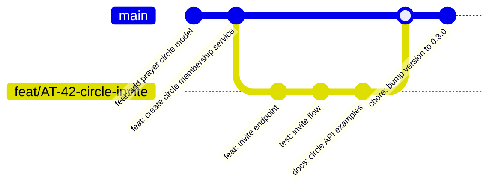

<p align="center">
  
  
  
  
  
  
</p>

<h1 align="center">Shelter API</h1>
<h3 align="center">A Digital Sanctuary for Faith and Mental Health</h3>

<p align="center">
  <em>Bridge the gap between spiritual growth and mental well-being through secure, anonymous, and compassionate community.</em>
</p>

<p align="center">
  <a href="#overview">Overview</a> •
  <a href="#features">Features</a> •
  <a href="#tech-stack">Tech Stack</a> •
  <a href="#architecture">Architecture</a> •
  <a href="#getting-started">Getting Started</a> •
  <a href="#api-reference">API Reference</a> •
  <a href="#deployment">Deployment</a> •
  <a href="#contributing">Contributing</a>
</p>

---

## Table of Contents

- [1. Overview](#1-overview)
- [2. Project Description](#2-project-description)
- [3. Features](#3-features)
- [4. Tech Stack](#4-tech-stack)
- [5. System Architecture](#5-system-architecture)
- [6. Folder Structure](#6-folder-structure)
- [7. Installation Guide](#7-installation-guide)
- [8. Environment Variables](#8-environment-variables)
- [9. Database Setup](#9-database-setup)
- [10. Running the Application](#10-running-the-application)
- [11. Development Workflow](#11-development-workflow)
- [12. API Structure](#12-api-structure)
- [13. Authentication & Authorization](#13-authentication--authorization)
- [14. Error Handling Strategy](#14-error-handling-strategy)
- [15. Logging & Monitoring](#15-logging--monitoring)
- [16. Testing Strategy](#16-testing-strategy)
- [17. Security Best Practices](#17-security-best-practices)
- [18. Deployment Guide](#18-deployment-guide)
- [19. CI/CD Workflow](#19-cicd-workflow)
- [20. Docker Support](#20-docker-support)
- [21. Contribution Guidelines](#21-contribution-guidelines)
- [22. Git Workflow Convention](#22-git-workflow-convention)
- [23. Coding Standards](#23-coding-standards)
- [24. Team Collaboration Notes](#24-team-collaboration-notes)
- [25. Scalability Considerations](#25-scalability-considerations)
- [26. Performance Optimization](#26-performance-optimization)
- [27. Troubleshooting](#27-troubleshooting)
- [28. FAQ](#28-faq)
- [29. Roadmap](#29-roadmap)
- [30. License](#30-license)
- [31. Maintainers](#31-maintainers)

---

## 1. Overview

Shelter is a faith-based mobile application that bridges the gap between spiritual growth and mental well-being. It provides a secure, anonymous, and supportive environment where Christians can find community, engage in prayer, and access professional counseling.

In a world where vulnerability is often met with judgment, Shelter serves as a **digital sanctuary**. By leveraging modern technology, the platform facilitates anonymous community interaction, structured spiritual accountability, and licensed professional support — all within a privacy-first architecture.

This repository hosts the **Shelter backend API** — a Node.js and Express.js RESTful service powering the entire platform. It is built with scalability, security, and data sovereignty as its primary architectural pillars.

---

## 2. Project Description

Shelter operates across three concentric engagement rings:

| Ring | Focus | Example |
|------|-------|---------|
| **Core** | Privacy & Trust | Anonymous profiles, secure auth, encrypted data |
| **Community** | Spiritual Disciplines | Prayer walls, accountability matching, devotionals |
| **Professional** | Mental Health | Licensed counselor marketplace, HIPAA-compliant infrastructure |

The backend is designed as a **decoupled, multi-service API** that enforces strict data isolation between these rings. Community interactions remain unlinked from real-world identities unless the user explicitly consents. This architecture ensures that a user's devotional streaks, prayer circle memberships, and counseling sessions exist in separate logical domains with distinct access controls.

---

## 3. Features

### Phase 1 — MVP (Core Foundation)
- **Secure Authentication** — JWT-based auth with refresh token rotation and device fingerprinting.
- **Privacy-First Profiles** — Pseudonymous user identities; real-world identifiers stored under separate encryption.
- **Anonymous Community Feed** — Chronological feed with AI-driven content moderation for toxicity detection.
- **Interactive Prayer Wall** — Shared intercession board with reactions, comments, and "Amen" counters.

### Phase 2 — Community & Consistency
- **Prayer Circles** — Private, invite-only intercession groups with granular membership controls.
- **Accountability Matching** — Peer-to-peer matching algorithm based on spiritual goals, timezone, and preferences.
- **Curated Content** — Daily devotionals authored by verified spiritual leaders with scheduled delivery.
- **Gamification (Streaks)** — Streak tracking for spiritual habits (prayer, devotional reading, check-ins) without performance pressure.

### Phase 3 — Counseling & Professional Support
- **Counselor Marketplace** — Licensed Christian counselor discovery with profiles, specialties, and availability.
- **Secure Booking** — Calendar-based scheduling with automated reminders and waitlist management.
- **Encrypted Communication** — End-to-end encrypted messaging for counselor-client sessions.
- **HIPAA-Compliant Infrastructure** — Audit logging, BAA-compliant data handling, and encrypted storage at rest and in transit.

---

## 4. Tech Stack

| Layer | Technology | Rationale |
|-------|-----------|-----------|
| **Runtime** | Node.js 20.x (LTS) | Long-term support, stable async I/O, broad ecosystem |
| **Framework** | Express.js 4.21.x | Minimal overhead, extensive middleware ecosystem, battle-tested |
| **Language** | TypeScript 5.x | Type safety, improved refactoring, self-documenting APIs |
| **Database** | PostgreSQL 16.x | ACID compliance, JSONB for flexible profiles, robust indexing |
| **ORM / Query Builder** | Knex.js (or Prisma) | Migration management, type-safe queries, connection pooling |
| **Caching** | Redis 7.x | Session store, rate limiting, feed caching, pub/sub |
| **Auth** | JWT + OAuth 2.0 | Stateless auth, refresh token rotation, social SSO readiness |
| **Media Storage** | AWS S3 | Scalable object storage, signed URLs, CDN integration |
| **Compute** | AWS ECS Fargate | Serverless containers, auto-scaling, no cluster management |
| **RDBMS Hosting** | AWS RDS for PostgreSQL | Managed backups, Multi-AZ, read replicas |
| **CDN** | CloudFront or S3 + CloudFront | Low-latency media delivery, DDoS protection |
| **Containerization** | Docker + Docker Compose | Reproducible environments, local dev parity |
| **CI/CD** | GitHub Actions | Pipeline-as-code, matrix testing, zero-downtime deployments |

---

## 5. System Architecture

```
┌──────────────────────────────────────────────────────────────┐
│                        Mobile Client                          │
│                    (React Native · iOS / Android)              │
└───────────┬──────────────────────────────────┬────────────────┘
            │ HTTPS / WSS                       │
            ▼                                    ▼
┌──────────────────────┐          ┌──────────────────────────┐
│   AWS CloudFront      │          │  WebSocket Gateway        │
│   (CDN / SSL Edge)    │          │  (WSS → API)              │
└──────────┬───────────┘          └────────────┬─────────────┘
           │                                    │
           ▼                                    ▼
┌──────────────────────────────────────────────────────────────┐
│                  AWS Application Load Balancer                 │
│              (TLS termination · Path-based routing)           │
└──────────────────────────┬───────────────────────────────────┘
                           │
                           ▼
┌──────────────────────────────────────────────────────────────┐
│                  AWS ECS Fargate Cluster                       │
│  ┌────────────────────────────────────────────────────────┐  │
│  │                   Express.js API                        │  │
│  │  • Auth Service          • Feed Service                │  │
│  │  • Profile Service       • Prayer Service              │  │
│  │  • Circle Service        • Counseling Service          │  │
│  │  • Content Service       • Notification Service        │  │
│  └──────────┬────────────────────────┬────────────────────┘  │
└─────────────┼────────────────────────┼────────────────────────┘
              │                        │
              ▼                        ▼
┌─────────────────────┐   ┌─────────────────────────┐
│   AWS RDS PostgreSQL │   │   AWS ElastiCache Redis  │
│   (Primary + Read    │   │   (Session / Cache /     │
│    Replicas)         │   │    Rate Limit / Queue)   │
└─────────────────────┘   └─────────────────────────┘
                                    │
                                    ▼
                         ┌─────────────────────────┐
                         │   AWS S3 (Media Assets)  │
                         │   + CloudFront CDN       │
                         └─────────────────────────┘
```

### Design Decisions

- **Modular monolith** — Domain-separated services within a single Express application, deployable as individual containers when horizontal scaling demands it.
- **Stateless API** — No server-side session state; all session data lives in Redis, enabling horizontal pod scaling.
- **Read replicas** — PostgreSQL read replicas absorb feed and analytics query load, while the primary handles writes.
- **Connection pooling** — pgBouncer (or RDS Proxy) manages database connection saturation under concurrency.

---

## 6. Folder Structure

```
shelter-api/
├── src/
│   ├── application/              # Use-case orchestration layer
│   │   ├── auth/
│   │   ├── profile/
│   │   ├── feed/
│   │   ├── prayer/
│   │   ├── circle/
│   │   ├── content/
│   │   ├── counseling/
│   │   └── notification/
│   ├── domain/                   # Business entities, value objects, domain events
│   │   ├── entities/
│   │   ├── value-objects/
│   │   └── events/
│   ├── infrastructure/           # External adapters (DB, cache, S3, queue)
│   │   ├── database/
│   │   │   ├── migrations/
│   │   │   ├── seeds/
│   │   │   └── repositories/
│   │   ├── cache/
│   │   ├── storage/
│   │   ├── messaging/
│   │   └── integrations/
│   ├── interfaces/               # API controllers, middleware, DTOs, validators
│   │   ├── http/
│   │   │   ├── controllers/
│   │   │   ├── middleware/
│   │   │   ├── validators/
│   │   │   └── dto/
│   │   └── websocket/
│   ├── shared/                   # Cross-cutting concerns
│   │   ├── errors/
│   │   ├── logging/
│   │   ├── monitoring/
│   │   ├── security/
│   │   └── utils/
│   ├── config/                   # Environment-aware configuration
│   │   ├── env.ts
│   │   ├── database.ts
│   │   ├── redis.ts
│   │   ├── aws.ts
│   │   └── logger.ts
│   └── index.ts                  # Application entry point
├── tests/
│   ├── unit/
│   ├── integration/
│   ├── e2e/
│   └── fixtures/
├── scripts/                      # Operational scripts (DB ops, seed, migrate)
├── docker/
│   ├── Dockerfile
│   ├── Dockerfile.dev
│   └── docker-compose.yml
├── .github/
│   └── workflows/
│       ├── ci.yml
│       └── cd.yml
├── docs/                         # Supplemental documentation
│   ├── ARCHITECTURE.md
│   ├── API.md
│   └── SECURITY.md
├── .env.example
├── .eslintrc.js
├── .prettierrc
├── tsconfig.json
├── jest.config.ts
├── knexfile.ts
├── package.json
└── README.md
```

---

## 7. Installation Guide

### Prerequisites

| Dependency | Version | Purpose |
|------------|---------|---------|
| Node.js | ^20.x | JavaScript runtime |
| npm / yarn | 10.x / 1.22.x | Package management |
| PostgreSQL | ^16.x | Primary database |
| Redis | ^7.x | Caching and session store |
| Docker (optional) | ^24.x | Containerized development |

### Clone & Install

```bash
git clone https://github.com/your-org/shelter-api.git
cd shelter-api
cp .env.example .env
npm ci
```

> **Note:** `npm ci` installs from the lockfile for deterministic builds. Use `npm install` only when adding new dependencies.

---

## 8. Environment Variables

All environment configuration is centralized in `src/config/env.ts` and validated at startup using `zod` or `joi`. A missing or malformed variable causes the process to exit immediately with a descriptive error.

```
# ─── Server ──────────────────────────────────────────────
NODE_ENV=development
PORT=4000
API_PREFIX=/api/v1

# ─── Authentication ──────────────────────────────────────
JWT_ACCESS_SECRET=
JWT_REFRESH_SECRET=
JWT_ACCESS_EXPIRES_IN=15m
JWT_REFRESH_EXPIRES_IN=7d
BCRYPT_SALT_ROUNDS=12

# ─── Database ────────────────────────────────────────────
DB_HOST=localhost
DB_PORT=5432
DB_NAME=shelter
DB_USER=shelter_app
DB_PASSWORD=
DB_POOL_MIN=2
DB_POOL_MAX=20

# ─── Redis ───────────────────────────────────────────────
REDIS_HOST=localhost
REDIS_PORT=6379
REDIS_PASSWORD=

# ─── AWS ─────────────────────────────────────────────────
AWS_REGION=us-east-1
AWS_ACCESS_KEY_ID=
AWS_SECRET_ACCESS_KEY=
S3_MEDIA_BUCKET=shelter-media-production
S3_SIGNED_URL_EXPIRY=3600

# ─── Moderation ──────────────────────────────────────────
MODERATION_API_KEY=
CONTENT_MODERATION_ENABLED=true

# ─── Logging ─────────────────────────────────────────────
LOG_LEVEL=debug
LOG_FORMAT=json

# ─── Rate Limiting ───────────────────────────────────────
RATE_LIMIT_WINDOW_MS=900000
RATE_LIMIT_MAX_REQUESTS=100
```

---

## 9. Database Setup

### Initialize PostgreSQL

```bash
# macOS (Homebrew)
brew install postgresql@16 && brew services start postgresql@16

# Linux (apt)
sudo apt install postgresql-16 && sudo systemctl start postgresql

# Create database and user
psql -U postgres -c "CREATE USER shelter_app WITH PASSWORD 'your_password';"
psql -U postgres -c "CREATE DATABASE shelter OWNER shelter_app;"
```

### Run Migrations & Seeds

```bash
# Run all pending migrations
npm run db:migrate

# Seed reference data (spiritual categories, content templates)
npm run db:seed

# Rollback the last migration batch
npm run db:rollback
```

### Database Conventions

- **Naming:** `snake_case` for tables and columns; plural table names (e.g., `prayer_circles`, `circle_members`).
- **Timestamps:** Every table includes `created_at` and `updated_at` with `DEFAULT NOW()`.
- **Soft deletes:** Use `deleted_at` (nullable timestamp) for recoverable resources.
- **Indexing:** Composite indexes on foreign key + timestamp combinations for feed queries.
- **Audit columns:** `created_by`, `updated_by` reference the user UUID for traceability.

---

## 10. Running the Application

### Development (hot-reload)

```bash
npm run dev
# Starts with ts-node-dev — watches src/ for changes, restarts automatically
```

### Production build

```bash
npm run build
npm run start
# Transpiles TypeScript → dist/, runs with minimal overhead
```

### Available Scripts

| Script | Command | Purpose |
|--------|---------|---------|
| `dev` | `ts-node-dev --respawn src/index.ts` | Development with auto-restart |
| `build` | `tsc -p tsconfig.json` | TypeScript compilation |
| `start` | `node dist/index.js` | Production entry point |
| `lint` | `eslint src/ --ext .ts` | Static analysis |
| `lint:fix` | `eslint src/ --ext .ts --fix` | Auto-fix lint issues |
| `format` | `prettier --write src/` | Code formatting |
| `test` | `jest --passWithNoTests` | Run all tests |
| `test:unit` | `jest tests/unit` | Unit-only test suite |
| `test:int` | `jest tests/integration` | Integration tests |
| `test:e2e` | `jest tests/e2e` | End-to-end tests |
| `test:cov` | `jest --coverage` | Coverage report |
| `db:migrate` | `knex migrate:latest` | Apply migrations |
| `db:rollback` | `knex migrate:rollback` | Revert migrations |
| `db:seed` | `knex seed:run` | Seed reference data |
| `docker:up` | `docker compose -f docker/docker-compose.yml up` | Start services |

---

## 11. Development Workflow



1. Pull latest `main` and create a feature branch: `feat/AT-42-circle-invite`.
2. Develop with TDD — write the test, watch it fail, implement, watch it pass.
3. Run `npm run lint && npm run test` before committing.
4. Open a Pull Request against `main` (or `develop` if using Git Flow).
5. Require at least **one approving review** and **passing CI checks** before merge.
6. Squash-merge into main with a conventional commit message.

---

## 12. API Structure

### Base URL

```
https://api.shelter.app/api/v1
```

### Route Layout

```
POST   /auth/register                          # Create account
POST   /auth/login                             # Authenticate
POST   /auth/refresh                           # Rotate tokens
POST   /auth/logout                            # Revoke session

GET    /v1/profiles/me                         # Get own profile
PATCH  /v1/profiles/me                         # Update profile
GET    /v1/profiles/:id                        # Get public profile (anonymized)

GET    /v1/feed                                # Anonymous community feed
POST   /v1/feed/posts                          # Create post
GET    /v1/feed/posts/:id                      # Get post detail
POST   /v1/feed/posts/:id/react                # React to post

GET    /v1/prayer-wall                         # Prayer wall entries
POST   /v1/prayer-wall                         # Submit prayer request
POST   /v1/prayer-wall/:id/amen                # Support a prayer

GET    /v1/circles                             # List joined circles
POST   /v1/circles                             # Create circle
POST   /v1/circles/:id/members                 # Invite / join
DELETE /v1/circles/:id/members/:userId         # Remove member

GET    /v1/content/devotionals                 # Daily devotionals
GET    /v1/content/devotionals/:id             # Single devotional
POST   /v1/content/devotionals/:id/complete    # Mark as read

GET    /v1/streaks                             # Current streak data

GET    /v1/counselors                          # List counselors
GET    /v1/counselors/:id                      # Counselor profile
POST   /v1/counselors/:id/book                 # Book session
GET    /v1/sessions                            # My sessions
POST   /v1/sessions/:id/messages              # Send encrypted message
```

### Pagination

All list endpoints use cursor-based pagination:

```json
GET /v1/feed?cursor=eyJpZCI6MTIzfQ&limit=20
{
  "data": [ ... ],
  "pagination": {
    "nextCursor": "eyJpZCI6NDV9",
    "hasMore": true
  }
}
```

### Response Envelope

Every response follows a consistent envelope:

```json
{
  "success": true,
  "data": { ... },
  "meta": {
    "requestId": "req_a1b2c3d4",
    "timestamp": "2026-05-11T14:30:00Z"
  }
}
```

Error responses:

```json
{
  "success": false,
  "error": {
    "code": "RATE_LIMIT_EXCEEDED",
    "message": "Too many requests. Please try again later.",
    "details": { "retryAfter": 45 }
  },
  "meta": {
    "requestId": "req_e5f6g7h8",
    "timestamp": "2026-05-11T14:30:15Z"
  }
}
```

---

## 13. Authentication & Authorization

### Authentication Flow

1. User registers with email/phone and creates a display name (pseudonym).
2. Server returns a short-lived **access token** (15 min) and a **refresh token** (7 days).
3. The access token is sent as `Authorization: Bearer <token>` on every request.
4. When the access token expires, the client calls `POST /auth/refresh` with the refresh token.
5. The server rotates the refresh token — the old one is invalidated (_&lt;insert DB query here&gt;_).
6. **Device fingerprinting** — refresh tokens are bound to a device hash to detect token theft.

### Authorization Model

Shelter uses a **role-based access control (RBAC)** layer enforced at the middleware level:

| Role | Scope |
|------|-------|
| `anonymous` | Public prayer wall read-only |
| `user` | Own profile, feed, circles, content |
| `circle_admin` | Circle membership management |
| `content_author` | Submit devotionals and curated content |
| `counselor` | Manage sessions, view client interactions |
| `admin` | User moderation, content moderation, system config |

```typescript
// Example guard
router.patch(
  '/profiles/me',
  authenticate,            // JWT verification
  authorize('user'),       // Role check
  validate(updateProfileSchema),
  ProfileController.update
);
```

---

## 14. Error Handling Strategy

A centralized error-handling middleware catches every thrown or unhandled error. Custom `AppError` subclasses map to HTTP status codes and structured JSON responses.

```typescript
// src/shared/errors/AppError.ts
export abstract class AppError extends Error {
  public readonly statusCode: number;
  public readonly code: string;
  public readonly details?: Record<string, unknown>;

  constructor(message: string, statusCode: number, code: string, details?: unknown) {
    super(message);
    this.statusCode = statusCode;
    this.code = code;
    this.details = details;
  }
}
```

### Error Hierarchy

| Class | HTTP Status | Use Case |
|-------|-------------|----------|
| `ValidationError` | 400 | Schema validation failure |
| `AuthenticationError` | 401 | Missing or expired token |
| `AuthorizationError` | 403 | Insufficient role |
| `NotFoundError` | 404 | Resource does not exist |
| `ConflictError` | 409 | Duplicate resource |
| `RateLimitError` | 429 | Too many requests |
| `InternalError` | 500 | Unhandled server error |

---

## 15. Logging & Monitoring

### Structured Logging

All logs are emitted as newline-delimited JSON (NDJSON) via the `pino` logger, making them ingestible by AWS CloudWatch Logs, DataDog, or Loki without transformation.

```json
{
  "level": "info",
  "time": 1715423400000,
  "requestId": "req_a1b2c3d4",
  "method": "POST",
  "path": "/api/v1/auth/login",
  "statusCode": 200,
  "latencyMs": 42,
  "userId": "usr_abc123"
}
```

### Request ID Correlation

Every incoming request receives a unique `requestId` (UUIDv7) set via middleware and propagated through all downstream service calls, database queries, and log entries.

### Monitoring

- **Health endpoint:** `GET /health` returns DB connectivity, Redis ping, memory usage, and uptime.
- **Application metrics:** Exposed via `GET /metrics` in Prometheus format (request count, latency histograms, error rate, DB pool utilization).
- **Alerting:** CloudWatch alarms trigger on p99 latency > 500ms, 5xx rate > 1%, and connection pool exhaustion.

---

## 16. Testing Strategy

| Layer | Tool | Coverage Target | Scope |
|-------|------|-----------------|-------|
| Unit | Jest + Supertest | ≥ 90% | Services, domain logic, value objects, validators |
| Integration | Jest + Supertest | ≥ 80% | Controller + middleware + repository flows |
| E2E | Jest + Supertest | Critical paths | Registration → login → feed → prayer wall |
| Contract | Pact (future) | N/A | Consumer-driven contract tests for mobile client |

### Testing principles

- **Real dependencies** in integration tests — spin up a test PostgreSQL container and Redis via `testcontainers`.
- **Factories over fixtures** — use `build()` factories (e.g., `buildUser()`) instead of static JSON fixtures for maintainability.
- **No network calls** in unit tests — all HTTP and database adapters are mocked.
- **Database rollback** — each integration test wraps in a transaction that is rolled back after execution.

```bash
# Run full suite
npm run test

# Watch mode for TDD
npm run test -- --watch

# With coverage
npm run test:cov
```

---

## 17. Security Best Practices

Shelter handles sensitive spiritual and mental health data. Security is not an afterthought — it is woven into every layer.

| Category | Practice |
|----------|----------|
| **Transport** | TLS 1.3 enforced at the ALB; HSTS header; HTTP → HTTPS redirect |
| **Auth tokens** | Access tokens: 15 min TTL; refresh tokens: 7 days, rotation with family detection |
| **Password storage** | bcrypt with cost factor 12; passwords never logged |
| **Rate limiting** | Global + per-endpoint rate limits via `express-rate-limit` backed by Redis |
| **Input validation** | Request body validated with `zod` schemas before reaching controller |
| **SQL injection** | Parameterized queries via Knex; no raw string interpolation |
| **CORS** | Whitelist of allowed origins; no wildcards in production |
| **Headers** | helmet.js middleware (X-Frame-Options, CSP, X-Content-Type-Options, etc.) |
| **Data encryption** | AES-256-GCM at rest (RDS encryption); S3 server-side encryption |
| **PII isolation** | Real-world identifiers (email, phone) stored in separate encrypted table from profile |
| **Audit logging** | All counselor-client interactions logged immutably |
| **Dependency scanning** | `npm audit` in CI; Dependabot alerts enabled |

---

## 18. Deployment Guide

### Production Topology

```
Route 53 → CloudFront → ALB → ECS Fargate (multi-AZ) → RDS PostgreSQL (Multi-AZ)
                                                          ElastiCache Redis (Cluster mode)
                                                          S3 (media)
```

### Deploying via ECS

```bash
# Build and push image
aws ecr get-login-password --region us-east-1 | docker login --username AWS --password-stdin <account>.dkr.ecr.us-east-1.amazonaws.com
docker build -f docker/Dockerfile -t shelter-api:latest .
docker tag shelter-api:latest <account>.dkr.ecr.us-east-1.amazonaws.com/shelter-api:latest
docker push <account>.dkr.ecr.us-east-1.amazonaws.com/shelter-api:latest

# Update ECS service
aws ecs update-service --cluster shelter-cluster --service shelter-api --force-new-deployment
```

### Database Migration in Deployments

Migrations run as a standalone **init container** before the new task starts serving traffic:

```yaml
# docker/Dockerfile.migrate
FROM node:20-alpine
WORKDIR /app
COPY dist/ .
CMD ["node", "dist/infrastructure/database/migrate.js"]
```

---

## 19. CI/CD Workflow

### Continuous Integration (GitHub Actions)

```yaml
name: CI
on: [pull_request]
jobs:
  lint:
    runs-on: ubuntu-latest
    steps:
      - uses: actions/checkout@v4
      - uses: actions/setup-node@v4
        with: { node-version: 20 }
      - run: npm ci
      - run: npm run lint

  test:
    runs-on: ubuntu-latest
    services:
      postgres:
        image: postgres:16
        env: { POSTGRES_DB: shelter_test, POSTGRES_PASSWORD: test }
      redis:
        image: redis:7
    steps:
      - uses: actions/checkout@v4
      - uses: actions/setup-node@v4
        with: { node-version: 20 }
      - run: npm ci
      - run: npm run test:int

  build:
    runs-on: ubuntu-latest
    steps:
      - uses: actions/checkout@v4
      - run: npm ci && npm run build && npm test -- --coverage
```

### Continuous Delivery

- Merges to `main` trigger an automatic build and push to ECR.
- The ECS service is updated with `--force-new-deployment` for zero-downtime rolling updates.
- Health check grace period: 60 seconds.
- Rollback: if the new task fails the ALB health check for 3 consecutive intervals, CodeDeploy automatically reverts to the previous task definition.

---

## 20. Docker Support

### docker-compose.yml (Development)

```yaml
version: '3.9'
services:
  api:
    build:
      context: ..
      dockerfile: docker/Dockerfile.dev
    ports:
      - '4000:4000'
    volumes:
      - ../src:/app/src
    environment:
      - NODE_ENV=development
      - DB_HOST=db
      - REDIS_HOST=redis
    depends_on:
      db:
        condition: service_healthy
      redis:
        condition: service_started

  db:
    image: postgres:16-alpine
    environment:
      POSTGRES_DB: shelter
      POSTGRES_USER: shelter_app
      POSTGRES_PASSWORD: local_dev
    ports:
      - '5432:5432'
    volumes:
      - pgdata:/var/lib/postgresql/data
    healthcheck:
      test: ['CMD-SHELL', 'pg_isready -U shelter_app']
      interval: 5s

  redis:
    image: redis:7-alpine
    ports:
      - '6379:6379'

volumes:
  pgdata:
```

### Start development environment

```bash
npm run docker:up
```

### Build production image

```bash
docker build -f docker/Dockerfile -t shelter-api:latest .
```

---

## 21. Contribution Guidelines

We welcome contributions from the community. To maintain code quality and architectural consistency, please follow these guidelines:

1. **Discuss first** — Open a discussion or issue before embarking on large features.
2. **Follow the conventions** — Adhere to the coding standards and Git workflow below.
3. **Keep PRs focused** — A single PR should address one concern. Split refactors from feature work.
4. **Write tests** — New code must include corresponding unit or integration tests.
5. **Update documentation** — If you change an API contract, update the relevant docs.
6. **Be respectful** — This is a faith-centered project. Maintain a tone of grace and professionalism in all interactions.

### PR Checklist

- [ ] Tests pass (`npm run test`)
- [ ] Linter passes (`npm run lint`)
- [ ] No new TypeScript errors
- [ ] API changes reflected in docs
- [ ] Commit messages follow conventional commits

---

## 22. Git Workflow Convention

We use **trunk-based development** with short-lived feature branches.

### Branch Naming

```
<type>/<ticket>-<short-description>
```

| Type | Usage |
|------|-------|
| `feat/` | New feature |
| `fix/` | Bug fix |
| `chore/` | Tooling, config, CI |
| `refactor/` | Code restructure without behavior change |
| `docs/` | Documentation-only changes |
| `test/` | Adding or fixing tests |

**Examples:** `feat/AT-42-circle-invite`, `fix/AT-58-null-profile-photo`, `chore/update-deps`

### Commit Message Convention

We enforce **Conventional Commits** via commitlint:

```
<type>(<scope>): <imperative description>

[optional body]
```

```
feat(circles): add invite-by-email endpoint
fix(prayer-wall): handle empty content gracefully
chore(deps): upgrade knex to v3.1
```

---

## 23. Coding Standards

### TypeScript

- **Strict mode** enabled in `tsconfig.json`. No `any` escapes — use `unknown` with type guards.
- **ES Modules** — `"type": "module"` in `package.json`; all imports use ESM syntax.
- **Naming conventions:**
  - Interfaces: PascalCase, prefixed with `I` (e.g., `IUserRepository`).
  - Types: PascalCase (e.g., `CreateUserDTO`).
  - Functions/Variables: camelCase.
  - Constants: UPPER_SNAKE_CASE.
  - Files: kebab-case (e.g., `prayer-circle-service.ts`).

### Express Routes

- Routes delegate to controllers; controllers delegate to services; services delegate to repositories.
- Middleware is scoped at the router level, not applied globally.
- Request validation is the first middleware after authentication.

### Linting & Formatting

- ESLint with `@typescript-eslint` rules.
- Prettier for consistent formatting (single quotes, trailing commas, 80 char width).
- Husky + lint-staged runs `eslint --fix` and `prettier --write` on pre-commit.

---

## 24. Team Collaboration Notes

### Communication

- **GitHub Issues** track bugs, feature requests, and technical debt.
- **GitHub Discussions** for architectural decisions and RFCs.
- **ADR (Architecture Decision Records)** stored in `docs/adr/` for all significant architectural choices.
- **PR reviews** are expected within 24 hours during the work week. Review for correctness, security, and alignment with domain boundaries.

### Onboarding

1. Run `npm run docker:up` to start the full local environment.
2. Run `npm run db:migrate && npm run db:seed` to initialize the database.
3. Run `npm run test` to verify everything is green.
4. Read `docs/ARCHITECTURE.md` for the system design overview.

### Definition of Done

- Code is peer-reviewed and merged.
- Tests are written and passing in CI.
- API documentation is updated (if applicable).
- Migration script is reversible (has a `down` method).
- No secrets, credentials, or PII are committed.

---

## 25. Scalability Considerations

| Strategy | Implementation |
|----------|---------------|
| **Stateless API** | No server-side session affinity; any pod can handle any request |
| **Horizontal pod autoscaling** | ECS Service Auto Scaling based on CPU (target: 70%) and memory (target: 75%) |
| **Database read replicas** | Feed, analytics, and read-heavy endpoints route to read replicas via Knex read/write splitting |
| **Caching** | Redis caches feed posts (TTL: 2 min), devotional content (TTL: 1 hour), rate limit counters |
| **Concurrency** | Node.js worker threads for CPU-intensive tasks (content moderation inference, image processing) |
| **Database indexing** | Composite indexes on `(circle_id, created_at)`, `(user_id, streak_date)`, `(counselor_id, session_date)` |
| **Queue-based processing** | Bull/BullMQ for async jobs (email notifications, content moderation, streak recalculation) |
| **Connection pooling** | PostgreSQL pool of 2–20 connections per pod; Redis pool of 50 connections |

### Projected Load

- **Target:** 50,000 DAU with 35% engagement ratio.
- **Peak throughput:** ~500 req/s at 99th percentile latency < 300ms.
- **Storage:** Approx. 500 MB/month of prayer wall and message data; media stored in S3 with lifecycle policies.

---

## 26. Performance Optimization

### Database

- **Query profiling** — Slow query log enabled; queries exceeding 100ms are flagged in CloudWatch.
- **N+1 prevention** — Knex `withGraphFetched` (Objection.js) or DataLoader for batched queries.
- **Materialized views** — Weekly devotional completion stats, counselor ratings, and circle activity metrics refreshed via cron.

### API

- **Compression** — `compression` middleware enabled for JSON responses.
- **Conditional responses** — `ETag` and `If-None-Match` headers prevent re-sending unchanged resources.
- **Batch endpoints** — `POST /v1/feed/batch` and `GET /v1/circles/batch` reduce chattiness for the mobile client.
- **Response trimming** — Exclude unnecessary fields from large list responses via sparse fieldsets (`?fields=id,title,createdAt`).

### Media

- **Signed URLs** — Clients upload directly to S3 via pre-signed URLs, bypassing the API server.
- **Image transformation** — S3 event triggers Lambda to generate thumbnails and WebP variants.
- **CDN** — CloudFront with 1-year cache TTL for immutable assets; cache invalidation on deploy.

---

## 27. Troubleshooting

### Common Issues

| Problem | Likely Cause | Solution |
|---------|-------------|----------|
| `ECONNREFUSED` on startup | PostgreSQL or Redis not running | `npm run docker:up` or start services manually |
| `JWT_SECRET not configured` | Missing `.env` file | Copy `.env.example` → `.env` and fill values |
| `relation "users" does not exist` | Migrations not run | `npm run db:migrate` |
| `429 Too Many Requests` | Rate limit hit | Wait for window to reset; check `Retry-After` header |
| `403 Forbidden` on profile endpoint | Missing or expired token | Refresh tokens via `POST /auth/refresh` |
| Container exits immediately in ECS | Health check failing | Check CloudWatch logs for startup errors; verify DB connection string |

### Getting Help

- Check `docs/` for architecture and security documentation.
- Search GitHub Issues for similar problems.
- If all else fails, open a new issue with the `bug` label and include the request ID from the error response.

---

## 28. FAQ

**Q: Is my data anonymous?**  
Community profiles are pseudonymous. Real-world identifiers (email, phone) are stored in an encrypted, isolated table and never exposed through the feed or prayer wall. Counseling sessions require identity disclosure to the licensed counselor only — and only with your explicit consent.

**Q: How is content moderated?**  
Phase 1 uses an AI-based moderation layer that scans all feed and prayer wall submissions for toxic language, hate speech, and sensitive content. Human moderators review flagged content. Phase 2 will introduce community-based reporting.

**Q: Can I run this locally without Docker?**  
Yes. You need PostgreSQL 16 and Redis 7 running locally. Configure the connection strings in `.env`, then run `npm run dev`.

**Q: What compliance standards does Shelter meet?**  
Phase 3 introduces HIPAA-compliant infrastructure for counseling features. All data is encrypted at rest and in transit. Audit logging covers all counselor-client interactions.

**Q: How do I add a new database migration?**  
```bash
npx knex migrate:make add_circle_settings
```
Edit the generated migration file with `up` and `down` methods, then run `npm run db:migrate`.

**Q: What's the refresh token rotation policy?**  
Each refresh token can be used once. When a refresh is performed, the old token is invalidated and a new one is issued. If a revoked token is presented, the entire token family is invalidated — the user must re-authenticate.

---

## 29. Roadmap

### Phase 1 — MVP (In Progress)

- [x] Project scaffolding and architecture
- [ ] Authentication system (register, login, token rotation)
- [ ] Anonymous profile management
- [ ] Community feed (CRUD + moderation)
- [ ] Prayer wall (submit, react, amen)
- [ ] CI/CD pipeline and Docker setup

### Phase 2 — Community & Consistency (Q3 2026)

- [ ] Prayer Circles (CRUD, invite, join, leave)
- [ ] Accountability matching algorithm
- [ ] Daily devotional content delivery system
- [ ] Streak tracking engine
- [ ] Push notification infrastructure (APNs / FCM)

### Phase 3 — Counseling & Professional Support (Q1 2027)

- [ ] Counselor profile and discovery
- [ ] Booking and calendar management
- [ ] End-to-end encrypted messaging
- [ ] HIPAA compliance audit and BAA
- [ ] Payment processing integration (Stripe)

### Future Considerations

- **Community reporting** — Trust & safety tooling for user-generated content.
- **Multi-language support** — i18n for devotionals and UI text.
- **Web client** — React-based dashboard for counselors.
- **AI prayer suggestions** — LLM-powered prompts based on user history.
- **Patreon-like giving** — Support verified spiritual leaders financially.

---

## 30. License

Distributed under the MIT License. See [LICENSE](./LICENSE) for more information.

---

## 31. Maintainers

### Core Team

| Role | Name |
|------|------|
| Lead Backend Engineer | [Your Name] |
| DevOps / Infrastructure | [Your Name] |
| Mobile Lead (React Native) | [Your Name] |
| Product Manager | [Your Name] |

### Contributors

Shelter is built with ❤️ by a distributed team of engineers, designers, and mental health advocates. See [CONTRIBUTORS.md](./CONTRIBUTORS.md) for the full list.

---

<p align="center">
  <strong>Developed with a commitment to integrity, technology, and spiritual growth.</strong><br/>
  <em>For questions or support, open an issue or reach out to the maintainers.</em>
</p>
